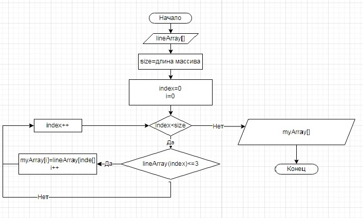

# Итоговая проверочная работа

## Ввод

Ввод первоначального массива строк будем организовывать через консоль. Данные в строке будем разделять пробелами. Методом Split отдельные строки, разделённые пробелами поместим по ячейкам строкового массива.

## Отбор

Отбор строк, заданной длины(не больше) выделим в метод (блок-схема прилагается).
В связи со сложностью реализации массива неизвестной длины, немного модифицируем блок-схему. Сначала найденные строки требуемого размера объединим в строку через пробелы, а затем методом Split поместим в массив-решение.

## Вывод

Результат выведем на консоль методом Join.

## Универсализация

Немного расширим функционал программы. Будем задавать с консоли длину искомых строк.
